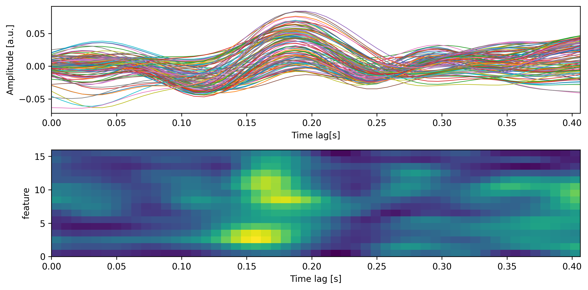
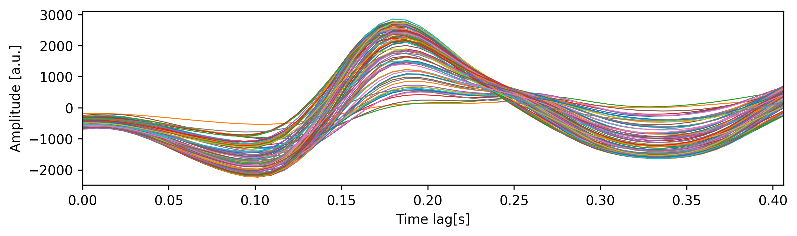
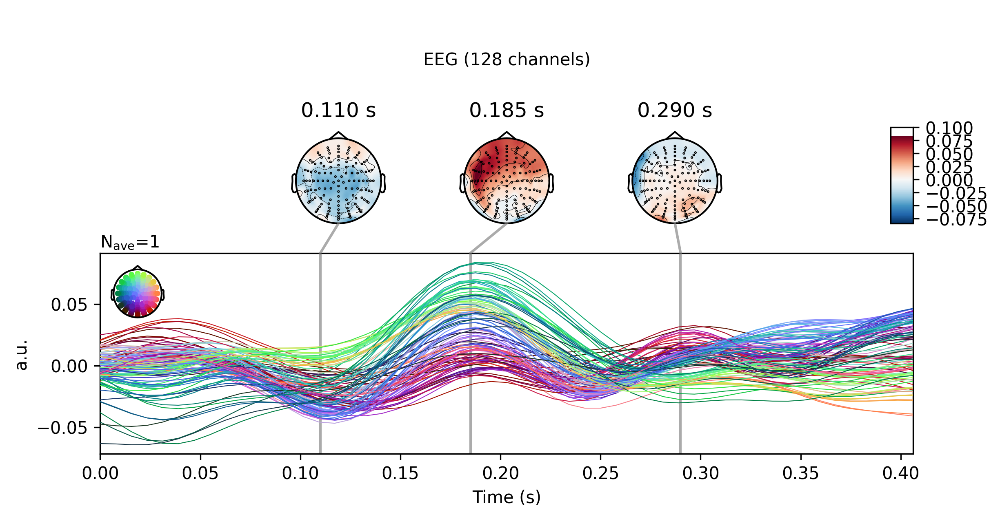

Basic usage
===========

This section describes the basic methods to compute a temporal response function on continuous data, estimate its predictive accuracy and visualize the results.

Background
----------
The TRF is a multivariate regression between a continuous stimulus and its neural response. The TRF can be applied as a forward model, using stimulus features to predict neural responses or as a backward model, using neural responses to reconstruct the stimulus. Because neural responses are delayed with respect to the stimulus, the regression must be computed across multiple time lags. The TRF predicts the estimand (i.e. neural response in a forward or stimulus in a backward model) as a weighted combination of predictor features. The model weights are chosen to minimize the mean squared error (MSE) between estimand and it's prediction. This is implemented in the following matrix multiplication:

.. math::
    w = (X^\intercal X+\lambda)^{-1}X^\intercal y

Where X is a matrix of time-lagged input features and y is a vector of output features.
:math:`(X^\intercal X)^{-1}` is the inverse autocovariance matrix of the predictor which accounts for the fact that both natural speech and brain signals are correlated with themselves over time. :math:`\lambda` is a diagonal matrix with a regularization parameter that can be optimized to improve stability and avoid overfitting.  :math:`X^\intercal y` is the covariance matrix of predictor and estimand [#f1]_. 

Because the TRF minimized the difference between the estimand and it's prediction within the training data set we must test wheter the estimated linear mapping generalizes. To do this, we use k-fold cross-validation, where the data is split into k subsets, a TRF is trained on k-1 of them and validated on the k\ :sup:`th` one. The data are rotated so that each segment is used for validation and the models accuracy can be obtained as the correlation or mean squared error averaged across all k validation sets.

Loading sample data
-------------------
We provide a small sample dataset for testing purposes. The data contains about two minutes of one individual's brain responses, recorded with a 128 biosemi EEG system while they were listening to an audiobook. It can be obtained by calling the :py:func:`mtrf.load_sample_data` function which will download the data if they are not present. The function can also divide the data into equally long segments and normalize them (subtracting the mean and dividing by the standard deviation) which are common preprocessing steps.::
    
    from mtrf.model import load_sample_data

    stimulus, response, fs = load_sample_data(n_segments=10, normalize=True)

In the above example, :py:data:`stimulus` contains a 16-band spectrogram of the speech signal and :py:data:`response` contains the 128-channel EEG recording. Both are resampled to 128 Hz and the sampling rate is stored in the variable :py:data:`fs`.

Forward model
-------------

To fit a forward model, create an instance of the TRF class, define the time interval (:py:const:`tmin` and :py:const:`tmax`) and use the :py:const:`TRF.train` method. ::
    
    from mtrf.model import TRF

    fwd_trf = TRF(direction=1)
    tmin, tmax = 0, 0.4  # range of time lag
    fwd_trf.train(stimulus, response, fs, tmin, tmax, regularization=1000)

Now, we can use the :py:meth:`TRF.predict` method to generate a prediction of the neural response based on the stimulus.
When provided with both stimulus and response, `TRF.predict` will also evaluate the prediction's accuracy.
Per default, it computes Pearson's correlation between the predicted and observed data as a metric for model accuracy but this can be changes as demonstrated in the next section.::

    prediction, r_fwd = fwd_trf.predict(stimulus, response)
    print(f"correlation between actual and predicted response: {r_fwd.round(3)}")

However, because we trained and tested on the exact same data, the correlation coefficient is inflated due to overfitting. To avoid this we can use The :func:`cross_validate` function from the :py:mod:`stats` module which tests a :py:class:`TRF` instance using k-fold cross-validation. During this process, the data is split into :py:const:`k` segments - all but one segments are used to train the TRF and the final segment is used to validate it's accuracy. The TRF is trained multiple times while the segments are rotated so that each segment is used for validation once. Finally, the TRFs correlation and MSE is obtained by averaging across all :py:const:`k` segments.
The default value for :py:const:`k` is -1, which will perform leave-one-out cross validation where the number of segments is equal to the number of trials in the stimulus and response. 

.. admonition:: How many folds should you use?

    It's hard to give definitive recommendations for the value of k because the effect of fold size depends on the dataset. At its core, the choice of k involves a trade-off between bias and variance. The larger k, the smaller the left out validation set and the larger the training set. Thus, large values of k will decrease the bias which is the difference between the average estimated and the true (usually unknown) accuracy. However, smaller validation sets lead to more variance in the accuracy estimate. Emprical work suggests that 10-20 folds yields reasonably low bias and variance across different datasets and models [#f2]_.

In the below example, we are using leave-one-out cross-validation to estimate the true accuracy of the previously trained forward TRF. Turns out the first estimate of the models accuracy was too high by a factor of 5!

::

    from mtrf.stats import cross_validate

    r_fwd, mse_fwd = cross_validate( fwd_trf, stimulus, response)
    print(f"mean correlation between actual and predicted response: {r_fwd.mean().round(3)}")

Backward model
--------------
To fit a backward model, just change the :py:const:`direction` parameter to -1. This will tell the TRF to use the response as predictor to estimate the stimulus. In the example below we are using a backward TRF to predict the acoustic envelope from the neural response. The envelope is the average across all spectral bands and represents the change of acoustic energy over time. The backward TRF predicts the envelope as a weighted combination of all 128 channels. This allows the model to exploit interactions between individual signals (and underlying neural sources) making it more powerful but also more susceptible to overfitting. ::

    envelope = [s.mean(axis=1) for s in stimulus]
    bwd_trf = TRF(direction=-1)
    bwd_trf.train(envelope, response, fs, tmin, tmax, regularization=1000)
    r_bwd, mse_bwd = cross_validate(bwd_trf, envelope, response)
    print(f"correlation between actual and predicted envelope: {r_bwd.round(3)}")

Visualization
-------------
The TRF class has a :py:meth:`plot` method to quickly visualize weights of a trained TRF. Because the weight matrix is three-dimensional (inputs-by-lags-by-outputs) visualization requires selecting from or averaging across one of the dimensions. In the below example, we are plotting the TRFs weights over time for the 7 :sup:`th` feature (i.e. spectral band) for each channel as well as the global field power (i.e. standard deviation across all channels) for every feature. ::

    from matplotlib import pyplot as plt
    fig, ax = plt.subplots(2)
    fwd_trf.plot(feature=6, axes=ax[0], show=False)
    fwd_trf.plot(channel='gfp', axes=ax[1], kind='image', show=False)
    plt.tight_layout()
    plt.show()

The top panel shows the forward TRFs weights across time. This is conceptually similar to an evoked response potential since the weights quantify the average effect a stimulus has on the neural response at a given delay. The bottom panel shows the color coded weights for each spectral band - bright yellow corresponds to high and dark blue to low weights. This depiction is also referred to as a spectrotemporal receptive field (STRF) because it shows the neural response to sound as a function of time and frequency.

It is not recommended to visualize a backward TRF in the same way. That is because the backward model must not only amplify the signal of interest (i.e. the neural activation pattern) but also suppress all signals of no interest. If those patterns are not orthogonal, the trade-off between amplification and suppression results in a complex spatial structure where the meaning of model weights can not be disentangled between the two tasks. However, we can transform backward to forward models [#f3]_ to allow a physiological interpretation of model weights::
    
    transformed = bwd_trf.to_forward(response)
    transformed.plot(feature=0)

Finally, we provide a method to easily convert a TRF to the MNE-Python framework. MNE is the most commonly used package for analyzing EEG and MEG data in Python and provides useful functions for visualization. The :py:meth:`to_mne_evoked` requires information about channel locations (here, we use a standard montage for the biosemi system) and returns a list of :py:class:`mne.Evoked` instances - one for each feature in the TRF. In the below example, we are converting and visualizing the TRF for the 7 :sup:`th` spectral band ::

    from mne.channels import make_standard_montage
    
    # use standard montage for the EEG system used for recording the response
    montage = make_standard_montage('biosemi128')
    evokeds = fwd_trf.to_mne_evoked(montage)
    evokeds[6].plot_joint([0.11, 0.185, 0.29], topomap_args={"scalings": 1}, ts_args={"units": "a.u.", "scalings": dict(eeg=1)})
    

The scalp topographies show the spatial pattern of TRF weights at specific points in time which can be informative of the underlying neural generators.

.. [#f1] Crosse, M. J., Di Liberto, G. M., Bednar, A., & Lalor, E. C. (2016). The multivariate temporal response function (mTRF) toolbox: a MATLAB toolbox for relating neural signals to continuous stimuli. Frontiers in human neuroscience, 10, 604.
.. [#f2] Kohavi, R. (1995). A study of cross-validation and bootstrap for accuracy estimation and model selection. In Ijcai (Vol. 14, No. 2, pp. 1137-1145).
.. [#f3] Haufe, S., Meinecke, F., Görgen, K., Dähne, S., Haynes, J. D., Blankertz, B., & Bießmann, F. (2014). On the interpretation of weight vectors of linear models in multivariate neuroimaging. Neuroimage, 87, 96-110.
