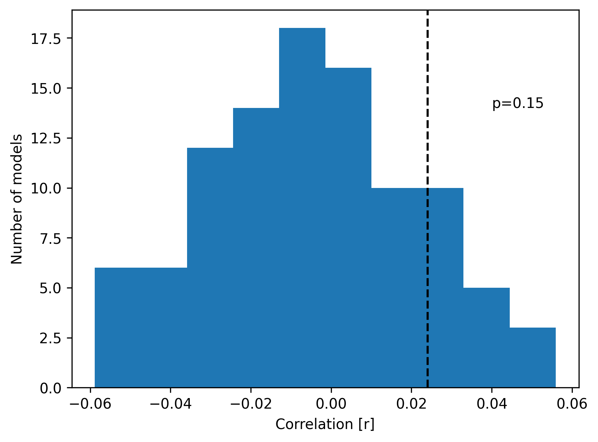

Statistical inference
=====================

In the previous section, we used nested cross-validation to compute an unbiased estimate of a forward TRF. The correlation between the predicted and actual brain response was 0.024 - is this a high or low value and has it any meaning at all? To answer this question, we need a statistical test.

Permutation
-----------
One way to determine the significance of an estimate without making assumptions about the underlying distribution is permutation testing [#f1]_. There are different ways to permute the data but the overarching idea is the same - the causal relationship between variables of interest (in our case stimulus and neural response) is removed by random permutation. Then, the statistical model is applied to the permuted data to compute the estimate of interest (e.g. correlation coefficient). This process is repeated many (thousand) times, each time with a different random permutation. Thus, we obtain the permutation distribution which reflects the expected observations if there is no actual relationship between the variables of interest. The p-value of the actual observation is given by the probability of obtaining a value as large or larger under the permutation distribution. A low p means that it is unlikely to observe a given value if there were no relationship between the variables.

Significance
------------

In the below example, we are using the :py:func:`permutation_distribution` function from the :py:module:`stats` module to estimate the distribution of correlation coefficients from the forward model under random permutation. We then compute the p-value of the observed correlation as the number of elements in the permuted distribution that are equal or higher divided by the number of permutations. ::
    
    import numpy as np
    from matplotlib import pyplot as plt
    from mtrf.model import TRF, load_sample_data
    from mtrf.stats import permutation_distribution
    r_obs = 0.024 # the previously observed correlation
    trf = TRF()  # use forward model
    stimulus, response, fs = load_sample_data(n_segments=5)
    for i in range(len(stimulus)):
        stimulus[i] = (stimulus[i] - stimulus[i].mean(axis=0))/stimulus[i].std(axis=0)
        response[i] = (response[i]- response[i].mean(axis=0))/response[i].std(axis=0)
    tmin, tmax = 0, 0.4  # range of time lags
    regularization = np.logspace(-1, 6, 10)
    r_perm, mse_perm = permutation_distribution(
        trf, stimulus, response, fs, tmin, tmax, trf.regularization, n_permute=10000
        )
    p = sum(r_perm>=r_obs)/len(r_perm)
    plt.hist(r_perm, bins=200)
    plt.axvline(x=r_obs, ymin=0, ymax=1, color='black', linestyle='--')
    plt.xlabel('Correlation [r]')
    plt.hist(r_perm, bins=200)
    plt.axvline(x=r_obs, ymin=0, ymax=1, color='black', linestyle='--')
    plt.xlabel('Correlation [r]')
    plt.ylabel('Number of models')
    plt.annotate(f'p={p.round(2)}', (0.06, 140))
    plt.show()

The p-value of the observed correlation is 0.24, which means that we obtain a correlation of that or larger size in about one quarter of observations. Thus, we would not reject our null hypothesis at the typically used significance level :math:`\alpha=0.05`. This is hardly surprising given that EEG has a poor signal-to-noise ratio and we are only using two minutes of data. Note that the permutation distribution is very sensitive to the amount of data because small amounts (for training and validation data) will produce more extreme results.

.. [#f1] Ernst, M. D. (2004). Permutation methods: a basis for exact inference. Statistical Science, 676-685.
