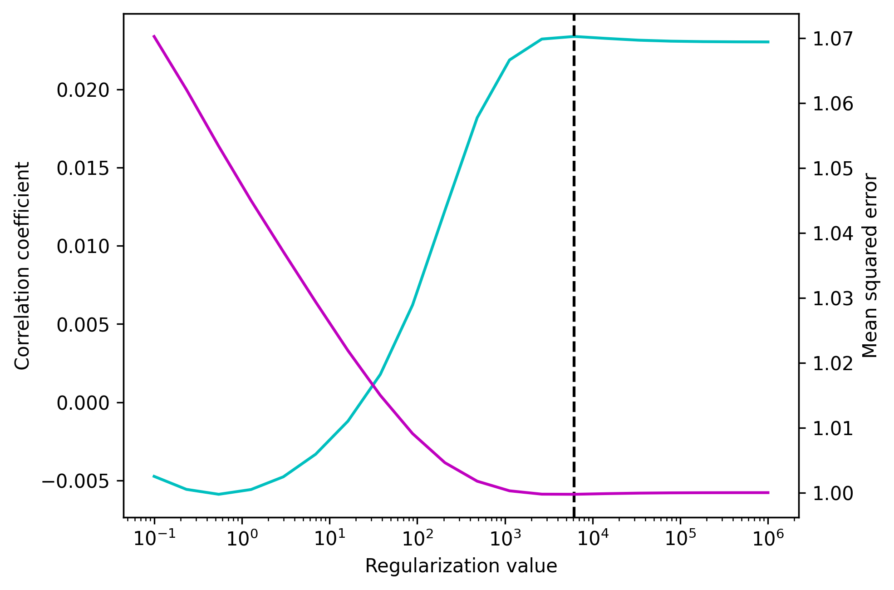

Regularization
==============

Ordinary least squares (OLS) regression minimizes the mean squared error (MSE) between predictions and observations. 
In the two-dimensional case that means finding the line that best fits a set of points. 
However, in practice, this often doesn't have the desirable outcome because the sampled data is not a perfect representation of the overall population. 
Thus, OLS optimizes the models fit on the sample to the detriment of its generalizability. 
To overcome this, one may use a regularization parameter :math:`\lambda` that penalizes large coefficients. 
In the below example, we use simulated data to demonstrate the effect of regularization. We apply regularized regression to four data points (filled circles) sampled from a larger set (unfilled circles). 

.. image:: images/reg.png
    :align: center
    :scale: 30 %

When :math:`\lambda=0`, this is equivalent to OLS regression (yellow line) and gives the best fit to the sample at the cost of deviating from the overall trend in the data (dashed black line). 
As the value of :math:`\lambda` is increased the line flattens because the slope is penalized. 
As lambda approaches infinity the regression produces a horizontal line, irrespective of the data. 
The optimal :math:`\lambda` value is the one that gives the best approximation of the population trend.
This value depends on multiple factors like the amount and quality of the data (more data requires less regularization) and the number of model parameters (larger models require more regularization) and has to be estimated from the data.

Optimization
------------

We compute multiple models with different values for :math:`\lambda` and select the model that makes the best prediction. 
This requires a metric for evaluating the model's prediction. 
We estimate the models accuracy for each candidate value of :math:`lambda` using cross-validation, pick the one that maximizes our metric, and use it to fit a model on the whole data. 
This whole procedure can be done by using the `TRF.train` function and passing a list instead of a single value for the :py:const"`regularization` parameter. 
:py:meth:`TF.train` will return the evaluation metric for each candidate value of :math:`\lambda`. 
In the below example we are optimizing lambda using Pearson's correlation as well as the (negative) mean squared error as metrics and visualize how they change as a function of :math:`lambda`.::

    import numpy as np
    from matplotlib import pyplot as plt
    from mtrf.model import TRF, load_sample_data
    from mtrf.stats import pearsonr, neg_mse
    
    stimulus, response, fs = load_sample_data(n_segments=10)
    tmin, tmax = 0, 0.4  # range of time lags
    regularization = np.logspace(-1, 6, 20)
    
    trf = TRF(metric=neg_mse)  # use negative meas squared error
    # multiply by -1 to get the mean squared error
    mse = trf.train(stimulus, response, fs, tmin, tmax, regularization) * -1

    trf = TRF(metric=pearsonr)  # use pearsons correlation
    r = trf.train(stimulus, response, fs, tmin, tmax, regularization)

    fig, ax1 = plt.subplots()
    ax2 = ax1.twinx()
    ax1.semilogx(regularization, r, color='c')
    ax2.semilogx(regularization, mse, color='m')
    ax1.set(xlabel='Regularization value', ylabel='Correlation coefficient')
    ax2.set(ylabel='Mean squared error')
    ax1.axvline(regularization[np.argmin(mse)], linestyle='--', color='k')
    plt.show()

According to the mean squared error metric, we obtain the best result for :math:`\lambda \approx 6000` which is marked by the vertical dashed line and using Pearson's correlation yields a similar result. 
However, all values between one thousand and one million result in similarly good models (accuracy slightly decreases for very high :math:`\lambda` values). 
On the other hand, picking a :math:`\lambda` value that is too low drastically reduces the models accuracy. This asymmetry is commonly observed in regularized regression.

.. admonition:: How many folds should you use?
   In the example, using Pearson's correlation and mean squared error as metrics yielded similar results. 
   However, they might diverge under some circumstances. 
   For example, EEG channels containing large artifacts will affect optimization more strongly if one uses the mean squared error as metric. 
   Thus, the :class:`TRF` class uses Pearson's correlation coefficient as a defauly because it is robust to outliers. 
   However, you can use any function as metric as long as it takes the observed and predicted data as inputs and returns a number that will be higher the better the prediction fits the data (i.e. that can be maximized to obtain the best model). 
   For an example of a metric, you can look at the `pearsonr` function in the `mtrf.stats` module.

More overfitting
----------------
In the previous section, we explained how cross-validation can be used to avoid overfitting. However, optimizing the value of :math:`\lambda` creates another source of overfitting. 
This is because, while the weights are only optimized for the training split, selecting the best :math:`lambda` involves the whole data set. 
Thus, optimizing :math:`lambda` on the same data used to validate the model inflates its accuracy estimate. To avoid this, we must use two nested cross-validation loops. 
The outer loop splits the data into a test and a train/validate set. 
The latter is used to find the best value for :math"`\lambda` and the test set is used to evaluate the final model. This way, the data used to determine the model's accuracy is never part of the optimization process.
The data are rotated in the outer loop, so that each segment is used for testing once and for each iteration of the outer loop, a full cross-validation loop is performed using the remaing :py:const:`k`-1 segments to find the best value for :math:`\lambda`.
This makes the nested cross-validation time consuming but it will produce an unbiased estimate of the model's accuracy while optimizing :math:`\lambda`.

This procedure is implemented in the :py:func:`nested_crossval` function which is part of the :py:module:`stats` module and returns the accuracy metric for each test set as well as the value of :math:`\lambda` selected from each train/validate set. In the examle below, we'll use it to compute and unbiased estimate of the models accuracy and compare it to the highest accuracy obtained during optimization in the previous section::

   from mtrf.stats import nested_crossval
    
   r_unbiased, best_regularization = nested_crossval(
       trf, stimulus, response, fs, tmin, tmax, regularization
       )

    print(f'With overfitting, correlation between the actual and predicted response is {r.max().round(4)} \n')

    print(f'Unbiased correlation between the actual and predicted response is {r_unbiased.mean().round(4)}')

Regularization Methods
----------------------
All previous examples used the default ridge regularization which penalizes large model weights. 
Another method is Tikhonov regularization which penalizes the first derivative (i.e. the change in) model weights, providing a temporally smoothed result [#f1]_. 
The regularization method is determined by the :py:const:`method` parameter, when creating an instance of the :py:class:`TRF` class. 
Yet another method is banded ridge regression which uses ridge regression but estimates :math:`\lambda` separately for different feature bands. 
This can be useful in multivariate models which combine discrete and continuous features. 
When using banded ridge you must provide the fit function with an additional :py:const:`bands` parameter denoting the size of the feature bands for which :math:`\lambda` is optimized. 
In the example below, we are computing a multivariate TRF with a 16-band spectrogram and the acoustical onsets (i.e. the half-wave rectified derivative of the envelope). 
We want to use the same :math:`\lambda` for all bands of the spectrogram and a separate :math:`\lambda` for the onsets so the band sizes are 16 and 1, respectively. 
The optimal values for :math:`\lambda` can be found in the diagonal of the regularization matrix stored in the :py:attr:`TRF.regularization` parameter ::
    
    trf = TRF(method='banded')
    onsets = [np.diff(s.mean(axis=1), prepend=[0]) for s in stimulus]
    for i, _ in enumerate(onsets):  # half-wave rectification
        onsets[i][onsets[i]<0] = 0
    combined = [np.vstack([s.T, o]).T for s, o in zip(stimulus, onsets)]
    regularization = np.logspace(-1, 5, 5)
    trf.train(combined, response, fs, tmin, tmax, regularization, bands=[16,1])
    print(f'optimal values for \u03BB: \n {np.diagonal(trf.regularization)[:18]}')

The first value is 0 and corresponds to the models bias term which is not regularized. 
The next 16 values are the optimal :math:`\lambda` for the spectrogram and the last value is the optimal :math:`\lambda` for the acoustic onsets. 
Note that banded ridge increases the number of parameters (by 1 for each band) and thus makes the model more susceptible to overfitting. Also, computation time increases exponentially with the number of bands because all combinations of :math:`\lambda` are tested.

.. [#f1] Crosse, M. J., Zuk, N. J., Di Liberto, G. M., Nidiffer, A. R., Molholm, S., & Lalor, E. C. (2021). Linear modeling of neurophysiological responses to speech and other continuous stimuli: methodological considerations for applied research. Frontiers in Neuroscience, 1350.

