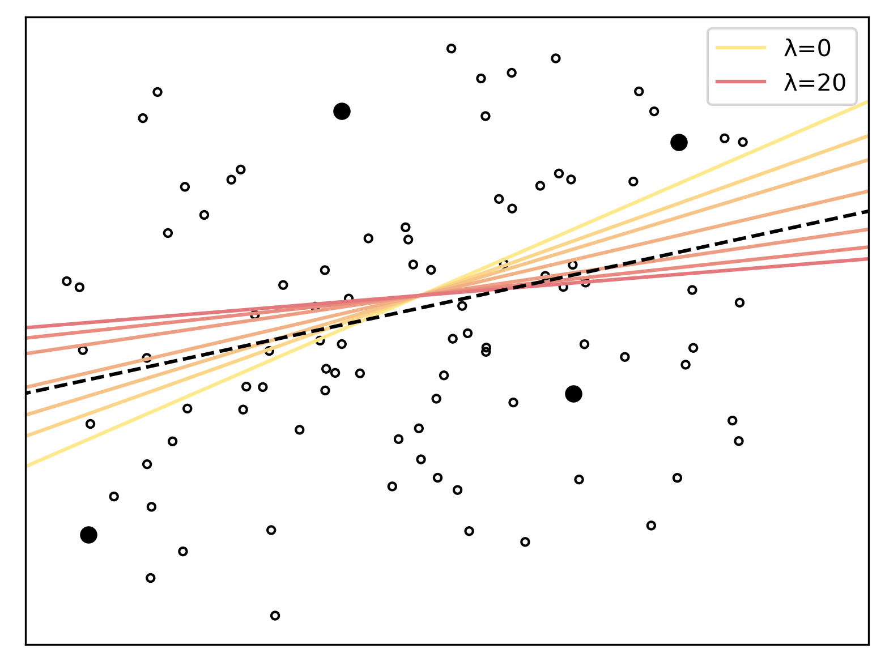
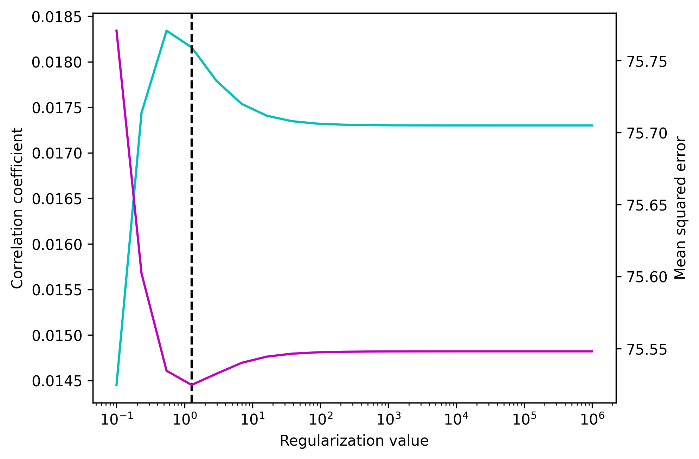

Regularization
==============

Ordinary least squares (OLS) regression minimizes the mean squared error (MSE) between predictions and observations. In the two-dimensional case that means finding the line that best fits a set of points. However, in practice, this often doesn't have the desirable outcome because the sampled data is not a perfect representation of the overall population. Thus, OLS optimizes the models fit on the sample to the detriment of its generalizability. To overcome this, one may use a regularization parameter `\lambda` that penalizes large coefficients. The image below shows regularized regression models, fitted to two dimensional data. Four points (filled black circles) were sampled to fit the model. If `\lambda=0`, OLS regression is performed and the line provides the best fit to the sample but deviates from the overall trend in the data (dashed black line).
As the value of `lambda` is increased the flattens because the slope is penalized. The best regularization value (i.e. the one that leads to the closest match with the trend in the whole data) lies somewhere in between. The optimal `\lambda` value depends on multiple factors like the amount and quality of the data (more data requires less regularization) and the number of model parameters (larger models require more regularization).

Optimization
------------

We can optimize regularization by testing out multiple values. For each value, the data is split into a training and validation set. The regression is fitted to the training data and the validation data is used to estimate the model's accuracy. Then, we select the regularization value that minimizes the MSE between the actual and predicted output and use it to train the final model. The whole procedure is implemented in the `TRF.fit` method, which has the same parameters as `TRF.train` but takes a list rather than a single value for regularization.::

    import numpy as np
    from matplotlib import pyplot as plt
    from mtrf.model import TRF, load_sample_data
    trf = TRF()  # use forward model
    stimulus, response, fs = load_sample_data() # data will be downloaded
    stimulus = np.array_split(stimulus, 10)
    response = np.array_split(response, 10)
    tmin, tmax = 0, 0.4  # range of time lags
    regularization = np.logspace(-1, 6, 20)
    correlation, error = trf.fit(
        stimulus, response, fs, tmin, tmax, regularization, k=-1
        )
    fig, ax1 = plt.subplots()
    ax2 = ax1.twinx()
    ax1.semilogx(regularization, correlation, color='c')
    ax2.semilogx(regularization, error, color='m')
    ax1.set(xlabel='Regularization value', ylabel='Correlation coefficient')
    ax2.set(ylabel='Mean squared error')
    ax1.axvline(regularization[np.argmin(error)], linestyle='--', color='k')
    plt.show()

The dashed line marks the regularization coefficient which yields the best TRF (i.e. the one that minimizes the mean squared error between predicted and actual response).

Overfitting
-----------
Optimizing `\lambda` can also result in overfitting because we are picking the value that provides the best fit for the data. To avoid this, we can split the data into three segments - training, validation and testing. Training and validation set are used to determine the best `\lambda` via cross-validation and the testing set is used to determine the accuracy of the final model. This way, the data that is used for testing was never part of the model fitting process. To avoid arbitrarily selecting testing data, we can use another cross-validation loop that goes through the segments so that all are used for testing. This procedure is implemented in the `TRF.test` method which takes the same arguments as `TRF.fit`.::

    r, mse, best_reg = trf.test(
        stimulus, response, fs, tmin, tmax, regularization, k=-1
        )
    print(f'Correlation between the actual and predicted response is {r.mean().round(3)}')

Note that the `TRF.test` method will not give a single answer regarding the best value for `\lambda` because the optimal value might vary across the different segmentations of the data - it will however provide an unbiased estimate of the model's accuracy.

Regularization Methods
----------------------
All previous examples used the default ridge regularization which penalizes large model weights. Another method is Tikhonov regularization which penalizes the first derivative (i.e. the change in) model weights, providing a temporally smoothed result [#f1]_. The regularization method is determined by the `method` parameter, when creating an instance of the `TRF` class. Yet another method is banded ridge regression which uses the same regularization as the regular ridge regression but estimates `\lambda` separately for different feature bands. This can be useful in multivariate models which combine discrete and continuous features. When using banded ridge you must provide the fit function with an additional `bands` parameter denoting the size of the feature bands for which `\lambda` is optimized. In the example below, we are computing a multivariate TRF with a 16-band spectrogram and the acoustical onsets (i.e. the half-wave rectified derivative of the envelope). We want to use the same `\lambda` for all bands of the spectrogram and a different `\lambda` for the onsets so the band sizes are 16 and 1. The optimal values for `\lambda` can be found in the diagonal of the regularization matrix stored in the `TRF.regularization` parameter ::
    
    trf = TRF(method='banded')
    onsets = [np.diff(s.mean(axis=1), prepend=[0]) for s in stimulus]
    for i, _ in enumerate(onsets):  # half-wave rectification
        onsets[i][onsets[i]<0] = 0
    combined = [np.vstack([s.T, o]).T for s, o in zip(stimulus, onsets)]
    regularization = np.logspace(-1, 5, 5)
    trf.fit(combined, response, fs, tmin, tmax, regularization, bands=[16,1])
    print(f'optimal values for \u03BB: \n {np.diagonal(trf.regularization)[:18]}')

    out:
        optimal values for λ:
         [0.         3.16227766 3.16227766 3.16227766 3.16227766 3.16227766
         3.16227766 3.16227766 3.16227766 3.16227766 3.16227766 3.16227766
         3.16227766 3.16227766 3.16227766 3.16227766 3.16227766 0.1       ]

The first value is 0 and corresponds to the models bias term which is not regularized. The next 16 values are the optimal `\lambda` for the spectrogram and the last value is the optimal `\lambda` for the acoustic onsets. Note that banded ridge increases the number of parameters (by 1 for each band) and thus makes the model more susceptible to overfitting. Also, computation time increases exponentially with the number of bands because all combinations of `\lambda` are tested.

.. [#f1] Crosse, M. J., Zuk, N. J., Di Liberto, G. M., Nidiffer, A. R., Molholm, S., & Lalor, E. C. (2021). Linear modeling of neurophysiological responses to speech and other continuous stimuli: methodological considerations for applied research. Frontiers in Neuroscience, 1350.

